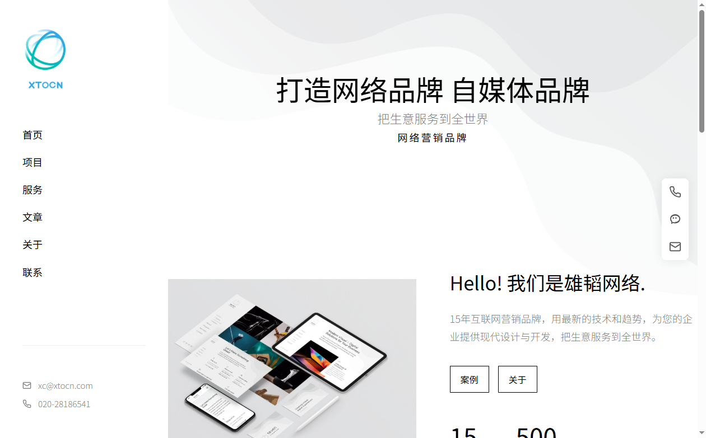
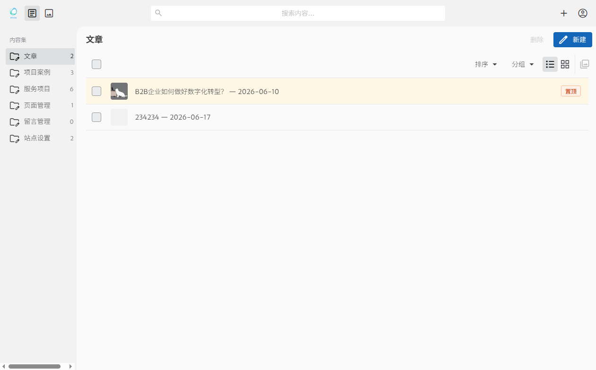

# 雄韬智网 / XTOCN Website

> **轻建网 · AI 辅助 · 想做什么就做什么**

一套 AI 辅助的轻量建站方案。不做主题市场、不做插件生态、不做数据库——只给你一套干净的代码骨架，配上在线编辑后台，剩下的事交给 AI。 

**演示站**：[www.xtocn.com](https://www.xtocn.com)

## 界面预览

### 网站前台



### 内容管理后台



---

## 传统建站的痛点

用 PHP 建站（WordPress、DedeCMS 等），拉一个能跑的网站要走完一整条链路：

```
装 PHP → 装 MySQL → 装 Apache/Nginx → 配虚拟主机
→ 创建数据库 → 导入 SQL → 配 wp-config.php
→ 装主题 → 装插件 → 插件冲突 → 调版本 → 终于能用了
```

上线之后呢？

- 每次页面请求：PHP 解析 → 查数据库 → 拼 HTML → 返回。几十次数据库查询，一个字：**慢**。
- 想加个功能：找插件 → 不兼容 → 找替代 → 改了代码升级又覆盖。**扩展是噩梦**。
- 换个服务器：导出 SQL → 传文件 → 导入 SQL → 改数据库密码 → 祈祷不出错。**迁移像搬家**。

## 这套方案怎么做

一个 Node.js，一个命令，跑起来就是完整网站 + 后台。

```
                         ┌──────────────┐
                         │   浏览器      │
                         └──────┬───────┘
                                │
              ┌─────────────────┼─────────────────┐
              ▼                 ▼                  ▼
        / (首页)          /posts (文章)      /admin (后台)
              │                 │                  │
              └─────────────────┼──────────────────┘
                                │
                         ┌──────▼───────┐
                         │  Astro SSR    │  ← 一个 Node 进程
                         │  直接读文件    │
                         └──────┬───────┘
                                │
                    ┌───────────┼───────────┐
                    ▼           ▼           ▼
               posts.md    projects.md   settings.yml
               (文章)       (案例)        (配置)
```

- **没有 PHP**：不需要装任何语言环境，Node.js 一把梭
- **没有数据库**：内容是 `.md` 文件，打开就能看，改完就生效
- **没有 Apache/Nginx**：Astro 自带服务端，一个端口搞定
- **没有插件系统**：加功能就是加文件，代码在你手上，想怎么改怎么改

---

## 上手三步

### 1. 安装

```bash
git clone <repo-url> && cd xtcms && npm install
```

### 2. 本地跑起来

```bash
npm run dev
```

浏览器打开 `http://localhost:4321`，网站已经在运行了。

打开 `http://localhost:4321/admin`，登录编辑内容。默认账号 `admin` / `admin`。

### 3. 部署到服务器

```bash
npm run build
```

传这 4 个到服务器：

```
dist/          # 程序
public/        # 附件
src/content/   # 内容
.env           # 配置
```

服务器上：

```bash
npm install --production && npm start
```

网站就上线了。

### 宝塔面板部署

如果你用宝塔管理服务器，4 步上线：

**1. 装 Node.js**

宝塔软件商店 → 搜索「Node.js版本管理器」→ 安装 → 安装 Node 22

**2. 上传项目**

```
宝塔文件 → /www/wwwroot/xtocn/
把 dist/、public/、src/content/、.env、package.json 传上去
```

**3. 添加 Node 项目**

宝塔网站 → Node 项目 → 添加 Node 项目：

| 配置项 | 值 |
|--------|-----|
| 项目目录 | `/www/wwwroot/xtocn` |
| 启动文件 | `dist/server/entry.mjs` |
| 启动命令 | `npm start` |
| 端口 | `4321` |
| 绑定域名 | 你的域名 |

**4. 放行端口 + 反向代理**

- 宝塔安全 → 放行 `4321` 端口
- 网站 → 添加反向代理：目标 `http://127.0.0.1:4321`

---

## 对比

| | PHP 建站（WordPress 等） | 这套方案 |
|---|---|---|
| 运行环境 | PHP + MySQL + Apache/Nginx | Node.js 一个进程 |
| 数据库 | 需要，增删改查几十次/页 | 不需要，直接读文件 |
| 页面速度 | 200ms ~ 2s（查库拼页面） | 50ms ~ 100ms（文件即内容） |
| 扩展功能 | 插件市场，兼容靠运气 | 改代码，完全自控 |
| 迁移服务器 | 导 SQL + 传文件 + 改配置 | 复制 4 个目录 |
| 备份 | 数据库备份 + 文件备份 | git push 或 tar 打包 |
| SEO | 依赖插件 | 内置关键字自动内链 |

---

## 架构：四层分离

```
┌────────────────────────────────┐
│  ④ 展示层  用户看到的页面        │  ← 改这里换皮肤
│    Astro .astro 文件            │
├────────────────────────────────┤
│  ③ 内容层  你的文章/案例         │  ← 不碰代码也能改
│    src/content/*.md             │    通过 CMS 后台编辑
├────────────────────────────────┤
│  ② 编辑层  浏览器里的后台        │
│    Sveltia CMS (/admin)         │
├────────────────────────────────┤
│  ① 存储层  服务器硬盘            │
│    文件系统，没有数据库          │
└────────────────────────────────┘
```

每层独立。换样式不改内容，写文章不改代码，迁移服务器复制目录即走。

---

## 功能特性

### 内容管理（/admin）

- 📝 **文章** — 标题、描述、标签、封面图、置顶、草稿、外链
- 🎯 **项目案例** — 分类、客户、封面图、精选、置顶
- 🛠 **服务介绍** — 图标(emoji)、描述、排序、详情页
- 📄 **单页面** — 关于我们等
- ⚙ **站点设置** — 页脚信息
- 🔗 **SEO关键字** — 关键字+链接，正文自动匹配内链（每关键字最多3次）

### 前端展示

- 📱 **移动端适配** — ≤768px 顶部导航+侧滑菜单，≥768px 左侧导航栏
- 🔍 **SEO 内链** — 文章/项目正文自动将关键字替换为链接
- 📌 **置顶排序** — 文章和项目支持置顶优先显示
- ⚡ **预加载导航** — 悬停链接时预加载目标页，切换几乎无感
- 🖼️ **智能图片** — 封面图自动 600px 缩略图，列表用小图，详情用原图
- 📅 **图片分类** — 上传图片按日期归档 `uploads/20260618/`
- 📞 **悬浮咨询栏** — 电话、微信二维码弹窗、邮箱

### 开放 API

外部系统（AI Skill、自动化工具）可通过 API 提交文章和上传图片。

**文章提交**：

```bash
POST /api/submit/article
Authorization: Bearer <CMS_API_KEY>
Content-Type: application/json

{
  "title": "文章标题",
  "description": "摘要（可选）",
  "content": "## 正文\n\nMarkdown 格式",
  "tags": ["标签1", "标签2"],
  "image": "/uploads/20260618/封面图.jpeg",
  "draft": false
}
```

**图片上传**：

```bash
POST /api/submit/upload
Authorization: Bearer <CMS_API_KEY>
Content-Type: multipart/form-data

file: 图片.png
```

图片自动进日期文件夹并生成 600px 缩略图。

---

## 项目文件

```
xtcms/
├── public/
│   ├── admin/              # CMS 后台
│   │   ├── index.html
│   │   ├── config.yml      # 内容集定义
│   │   └── sveltia-cms.js
│   ├── assets/             # 静态资源（微信二维码等）
│   └── uploads/            # CMS 上传的图片（按日期分文件夹）
│       └── 20260618/
├── src/
│   ├── pages/
│   │   ├── index.astro     # 首页
│   │   ├── posts/          # 文章列表 & 详情
│   │   ├── projects/       # 项目列表 & 详情
│   │   ├── services/       # 服务列表 & 详情
│   │   ├── about.astro     # 关于页
│   │   ├── contact.astro   # 联系页
│   │   └── api/
│   │       ├── cms/        # CMS 后端 API（auth/files/commit/upload）
│   │       └── submit/     # 开放 API（article/upload）
│   ├── components/
│   │   └── shared/         # SafeImage, FloatingContact 等
│   ├── layouts/
│   │   └── BaseLayout.astro
│   ├── content/            # 📝 CMS 编辑的内容（Markdown）
│   │   ├── posts/          #   文章
│   │   ├── projects/       #   项目案例
│   │   ├── services/       #   服务
│   │   ├── pages/          #   单页面
│   │   └── keywords/       #   SEO 关键字
│   ├── lib/                # 工具函数
│   │   ├── content.ts      # 文件系统内容读取
│   │   ├── auto-link.ts    # SEO 关键字自动内链
│   │   ├── image-utils.ts  # 图片处理（缩略图+日期归档）
│   │   ├── service-icons.ts # 服务图标映射
│   │   └── auth-config.ts  # 认证配置
│   ├── middleware.ts        # 路由中间件（静态文件+上传服务）
│   └── styles/
│       └── global.css
├── .env.example            # 环境变量模板
├── astro.config.mjs
└── package.json
```

## 环境变量

复制 `.env.example` → `.env`：

```
CMS_USER=admin               # 后台用户名
CMS_PASS=你的密码              # 后台密码
CMS_SECRET=随机字符串           # JWT 签名密钥
CMS_API_KEY=你的API密钥        # 开放 API 认证密钥
PORT=4321                    # 端口（可选）
```

## 扩展指南

### 加页面

在 `src/pages/` 新建 `xxx.astro`，路径自动为 `/xxx`。

### 加内容类型

编辑 `public/admin/config.yml`，加一个 collection。然后在 `src/content/` 建对应文件夹。最后写个页面读取就行了——不用装插件。

### 改样式

Tailwind CSS v4，直接在 HTML/组件上写原子类。全局样式在 `src/styles/global.css`。

### 换布局

`src/layouts/BaseLayout.astro` 是全局壳（导航栏 + 页脚 + 右侧悬浮咨询栏），改一处全站生效。

### 接 AI 自动化

用 `/api/submit/article` + `/api/submit/upload` 两个接口，OpenClaw Skill 或其他 AI Agent 可以自动发文配图。

---

## 轻建网哲学

传统建站给你一个成品房子，你只能在里面摆家具。插件市场像个建材超市——看着什么都有，真要用的时候不是不兼容就是收费。

**轻建网给你的是毛坯房 + 一支施工队（AI）。**

```
传统 CMS：   [主题] + [插件A] + [插件B] → 💥 冲突 → 妥协
轻建网：     想法 → 告诉 AI → 代码落地 → 完全符合预期
```

不改配置、不拼插件、不用 MySQL。代码是你自己的，AI 帮你写，你审一下改一下就行。快、轻、自由。

## 开源治理

本项目不是一个「个人仓库」，而是按正规开源项目标准运作的社区项目。

### 项目独立性声明

- 代码为原创开发，不包含任何雇佣关系下的职务作品
- 项目不由任何单一公司控制或拥有
- 商标「雄韬智网 / XTOCN」归项目社区所有
- 所有贡献者按 Apache-2.0 许可证授权其贡献

### 治理文档

| 文件 | 用途 |
|------|------|
| [GOVERNANCE.md](GOVERNANCE.md) | 治理结构、角色权限、决策机制 |
| [CONTRIBUTING.md](CONTRIBUTING.md) | 贡献指南、PR 规范 |
| [SECURITY.md](SECURITY.md) | 安全漏洞报告流程 |
| [CODE_OF_CONDUCT.md](CODE_OF_CONDUCT.md) | 社区行为准则 |
| [NOTICE](NOTICE) | 第三方依赖声明 |
| [LICENSE](LICENSE) | Apache-2.0 开源许可 |

### 为什么选 Apache-2.0

Apache-2.0 是企业最友好的开源许可证之一：明确授予专利许可、允许商用、修改和分发，同时保留原作者的版权声明。绝大多数企业合规部门可以直接通过，无需额外法律审查。

## License

Apache-2.0 © 2026 XTOCN Open Source Contributors
